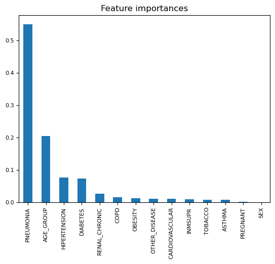

# COVID Data Study

## Purpose

### The main goal of this project is to build a machine learning model that, given a Covid-19 patient's current symptom, status, and medical history, will predict whether the patient is in high risk or not. We decided to focus on Covid-19 due to its continued impact on the world's population. While deaths have declined, we are still interested in the factors that lead to severe complications.

## Summary

### We started our project using anonymous data from <https://www.kaggle.com/datasets/meirnizri/covid19-dataset>. Below is the description of the data from the source website: 

<i> <ul>The dataset was provided by the Mexican government (link). This dataset contains an enormous number of anonymized patient-related information including pre-conditions. The raw dataset consists of 21 unique features and 1,048,576 unique patients. In the Boolean features, 1 means "yes" and 2 means "no". values as 97 and 99 are missing data.

sex: 1 for female and 2 for male.   age: of the patient.  classification: covid test findings. Values 1-3 mean that the patient was diagnosed with covid in different  degrees. 4 or higher means that the patient is not a carrier of covid or that the test is inconclusive.  patient type: type of care the patient received in the unit. 1 for returned home and 2 for hospitalization.  pneumonia: whether the patient already have air sacs inflammation or not.  pregnancy: whether the patient is pregnant or not.  diabetes: whether the patient has diabetes or not.  copd: Indicates whether the patient has Chronic obstructive pulmonary disease or not.  asthma: whether the patient has asthma or not.  inmsupr: whether the patient is immunosuppressed or not.  hypertension: whether the patient has hypertension or not.  cardiovascular: whether the patient has heart or blood vessels related disease.  renal chronic: whether the patient has chronic renal disease or not.  other disease: whether the patient has other disease or not.  obesity: whether the patient is obese or not.  tobacco: whether the patient is a tobacco user.  usmr: Indicates whether the patient treated medical units of the first, second or third level.  medical unit: type of institution of the National Health System that provided the care.  intubed: whether the patient was connected to the ventilator.  icu: Indicates whether the patient had been admitted to an Intensive Care Unit.  date died: If the patient died indicate the date of death, and 9999-99-99 otherwise.</i></ul> 

### Our analysis of the data was conducted in Jupyter Notebook and is located in the <a href="https://github.com/rvroomiii/group_hub/blob/main/data_analysis/COVID_dataAnalysis_final.ipynb">COVID_DataAnalysis_Final.ipynb</a> file.

### After carefully reviewing the data we decided to break the information into two data sets based on patient age. Following the split, we used data from the following columns to inform our model:

PNEUMONIA, AGE, PREGNANT, DIABETES, COPD, ASTHMA, INMSUPR, HYPERTENSION, OTHER_DISEASE, CARDIOVASCULAR, OBESITY, RENAL_CHRONIC, TOBACCO

### All features were ranked following our analysis and it was determined that pneumonia and age were the two top features at 54% and 20% respectively.

## Results

-   Different ML models were trained on top of these 14 features to predict patients' mortality or discharge outcomes. From different ML models (e.g., Logistic Regression, random forest, Gradient Boosting Classifier, support vector machine, AdaBoost, and neural network), the logistic Regression model performance better with an accuracy of 91.4% followed by SVM (91.3%) and Deep learning (91.2%).

-   The trained models were then tested on the test dataset. Again, four models (Logistic Regression, Gradient Boosting Classifierneural network) had the best performance with an accuracy of 91.2%, followed by random forest (91.1%) accuracy rate. SVM has the least accuracy rate of 10.4%. Easy Ensemble AdaBoost Classifier model is the only model with high sensitivity rate of 84% .
