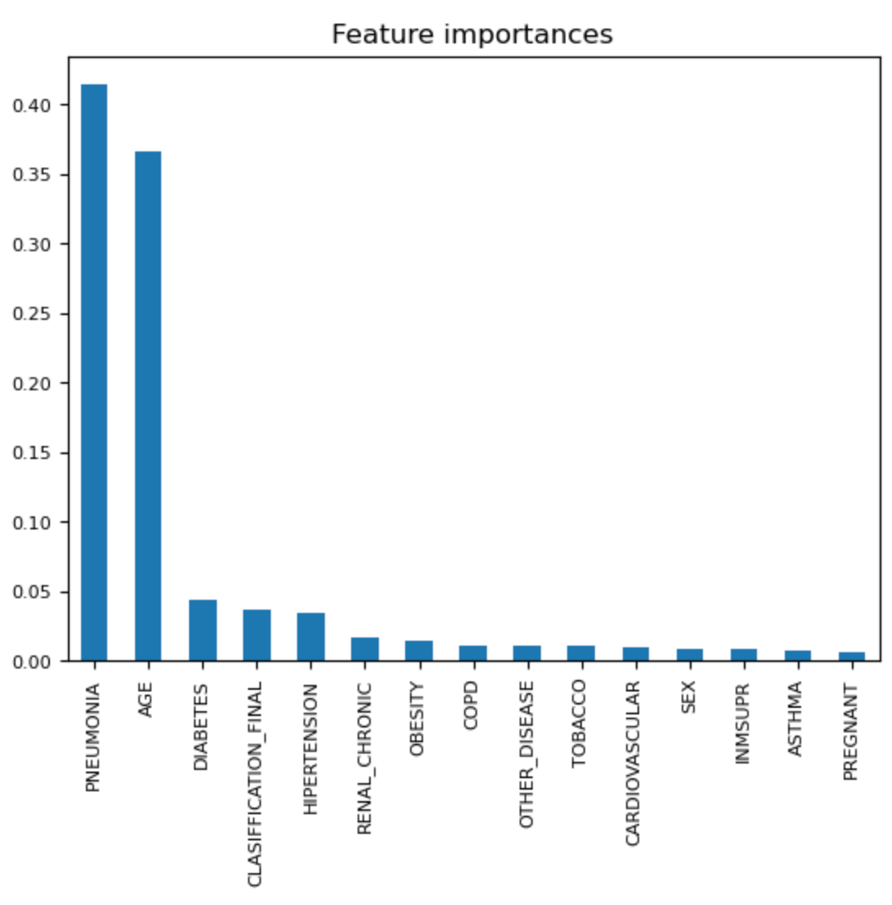

# COVID Data Study

## Purpose

### The main goal of this project is to build a machine learning model that, given a Covid-19 patient's current symptom, status, and medical history, will predict whether the patient is in high risk or not.

## Summary

### We found anonymous data from <https://www.kaggle.com/datasets/meirnizri/covid19-dataset>. After reviewing the columns, it was determined that "PREGNANT" needed to be adjusted to show only patients identified as pregnant or not pregnant. Values of 97 and 98 were converted to 0 as they reflect patients who did not identify as pregnant.

### The "CLASSIFCATION_FINAL" column was cleaned to reflect only those patients that tested positive for COVID-19.

### On further review, it was also determined that the columns "INTUBED","ICU","MEDICAL_UNIT","USMER","PATIENT_TYPE" should be removed because they were not important to our analysis.

### Following the cleaning of the data, the columns list below remained for the purposes of our data analysis.

{width="505"}

### After training and scaling the data, we performed Logistic Regression, Random Forest Classifier, Gradient Boosting Classifier, Easy Ensemble AdaBoost Classifier, Support Vector Machine and Deep Learning. After running the various models, the highest score attained was 89%. Gradient Boosting Classifier and Deep Learning both produced results of 89% accuracy.

### In an effort to better understand the data, Feature Importance was performed. The feature importance showed that pnemonia was the most impactful feature at 93%.

{width="447"}

### In an effort to understand the impact of all underlying diseases, feature importance was run again. The results showed that pneumonia was 70%.

{width="418"}

### Finally, all features were considered. This time, pneumonia and age were the two top features at 41% and 36% respectively.

{width="376"}

## Results
### This will be updated as more analysis is completed.
